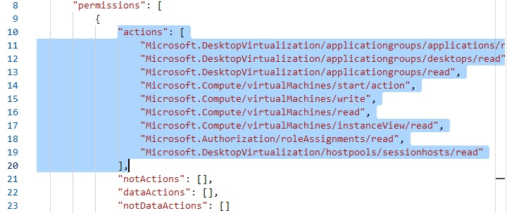

# Windows Virtual Desktop Session Host Launcher
This web-application is meant to enable end-users to start their own WVD Session Hosts when it is unavailable or turned-off.

Pre-requisites:
* WVD Spring 2020 Update
* User with Desktop Virtualization User role assigned on any Application Group

 

### How to deploy this web-app on Azure

#### Step 1: Deploy to Azure
1) [](https://portal.azure.com/#create/Microsoft.Template/uri/https%3A%2F%2Fraw.githubusercontent.com%2Fenstepgabriel%2FIX5q19WnW7%2Fmaster%2Fdeploy%2FdeploymentTemplate.json)
2) You will be prompted to:
- inform an existing Resource Group or create a new one 
- inform a Site Name for this application. You can name it as ```wvd-shl-\<your-company-name>```
 
3) Click on **Review + create**, review your deployment info and then click on **Create**.
Now you will see the deployment window showing its progress.
Three services will be deployed for this solution:
- Azure App Service Plan Windows S1
- Azure App Service
- Azure Application Insights

4) Proceed to Step 2 when it tells *Your deployment is complete*.
 
#### Step 2: Register your application
1) Go to the Resource Group where you deployed your application.
2) Open the App Service resource and copy its URL clicking on the button shown below:
 
3) Open your *Azure Active Directory* and select **App registrations**
4) Click on **+ New registration** to register a new application
- Give it a name. I suggest to name it *Session-Host-Launcher*.
- For supported account types eslect *Accounts in this organizational directory only - Single tenant*.
- Paste the URL you copied on step 2.2. 
5) Click **Register**.
 
6) Right after you registered your application, copy the following info from the *Overview* pane
- Application (client) ID
- Directory (tenant) ID
 

#### Step 3: Configure your app registration
1) Open the **Authentication** pane
2) Under *Platform configurations*, on *Web*, click on **Add URI** and add the following URL: ```https://<your-app-name>.azurewebsites.net/signin-oidc```
3) Under *Logout URL*, set the following URL: ```https://<your-app-name>.azurewebsites.net/logout```
4) Under *Implicit grant*, check **ID tokens**
5) Click on **Save**
6) Open the **Certificates & secrets** pane
7) Under *Client secrets* click on **New client secret**. Give it a name and set it to *Never* expire. Copy the generated key and store it on a notepad as you can see this only once. You will need it later.  

8) Open **API permissions** pane and then click on **Add a permission**.
9) Add the following permissions:
```
Azure Service Management - user_impersonation
Microsoft Graph - user.read
Microsoft Graph - directory.read.all
```
 

#### Step 4: Configure your web-application
1) Open the Resource Group you created on the previous steps and then open the App Service you deployed before.
2) Open the **Configuration** pane under Settings.
3) Edit the following settings with the values you copied before
- **AzureAd:Domain** - you can find it at the Overview pane of Azure Active Directory under Tenant Information
- **AzureAd:TenantId** - The directory (tenant) ID you copied on Step 2.6
- **AzureAd:ClientId** - The application (client) ID you copied on Step 2.6
- **AzureAd:ClientSecret** - The application secret you copied on Step 3.7
 
4) Click on *Save*
5) Go to the *Overview* pane and click on **Restart**
#### Step 5: Grant role to Service Principal
1) Open the Resource Group where your WVD is deployed.
2) Open the **Access control (IAM)** pane
3) Under *Add*, click on **Add custom role**
 
4) Give it a name, like ```WVD Session Host Launcher Application Role``` and a description
5) Select the **JSON** tab and click on **Edit**
6) Paste the following scopes under ```Properties > Permissions > Actions```, inside the brackets:
```
"Microsoft.DesktopVirtualization/applicationgroups/applications/read",
"Microsoft.DesktopVirtualization/applicationgroups/desktops/read",
"Microsoft.DesktopVirtualization/applicationgroups/read",
"Microsoft.Compute/virtualMachines/start/action",
"Microsoft.Compute/virtualMachines/write",
"Microsoft.Compute/virtualMachines/read",
"Microsoft.Compute/virtualMachines/instanceView/read",
"Microsoft.Authorization/roleAssignments/read",
"Microsoft.DesktopVirtualization/hostpools/sessionhosts/read",
"Microsoft.DesktopVirtualization/hostpools/sessionhosts/write"
```
7) It should look like the image below
 
8) Click on **Review + create**
9) After you created the new role, click on *Add* and then click on **Add role assignment**
10) It should open a pane on the right side of your screen. Under *Role*, select the new role you have created. Under *Select*, search for your Service Principal's name (the same you created on step 2.4). Select it and click **Save**.
11) After registering the Service Principal, you can click on the application URL. Login in with an account with privileges to WVD Session Hosts and use it.